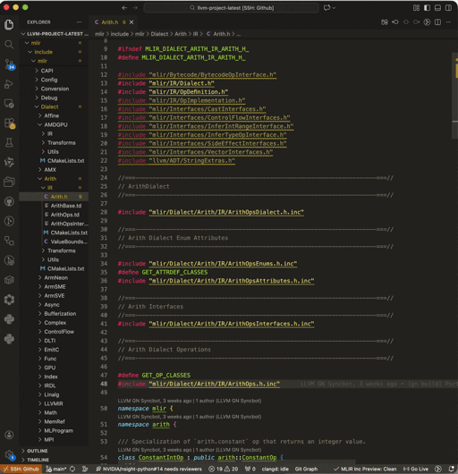
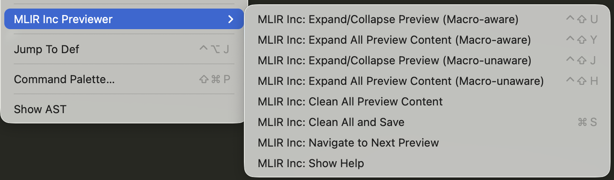
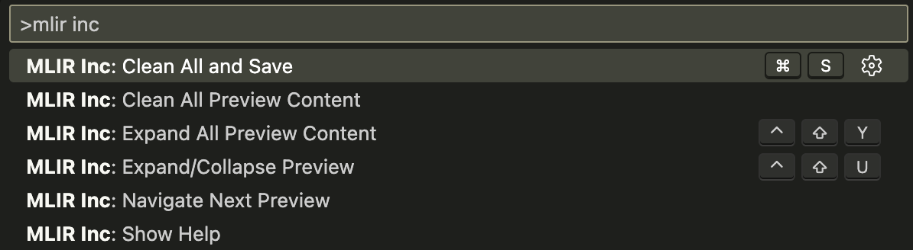

# MLIR Inc Previewer - VS Code Extension

[MLIR Inc Previewer](https://github.com/ConvolutedDog/mlir-inc-previewer) is a powerful VS Code extension designed specifically for MLIR (Multi-Level Intermediate Representation) developers that provides intelligent previewing and management of .inc files directly within your source code.

<div align="center">
  
  <br>
  <strong>MLIR Inc Previewer Usgae Example</strong>
  <br>
</div>

## 0. Quick Start

- Open a C/C++ file containing `.inc` include statements
- Use one of these methods:
   - Place cursor near `#include "xxx.inc"` and press `Ctrl+Shift+U` to expand a single preview block
   - Press `Ctrl+Shift+Y` to expand all preview blocks
   - Press `Ctrl+S` (`Cmd+S` for MacOS) to clean all preview blocks and save file
   - Right-click -> See MLIR menu to choose one of the following actions:
     - Expand/Collapse All Preview Content
     - Expand All Preview Content
     - Clean All Preview Content
     - Clean All and Save
     - Navigate to Next Preview
   - Command palette -> Search "mlir inc" to find the `MLIR Inc` commands
- Keyboard Shortcuts

   | Shortcut | Action |
   |----------|--------|
   | `Ctrl+Shift+U` | Expand/Collapse a single .inc preview block |
   | `Ctrl+Shift+Y` | Expand all preview blocks |
   | `Ctrl+S` | Clean all preview blocks and save file |

## 1. Detailed Usage Instructions

### 1.1 Example

- Before using this extension, you cannot see the .inc file content directly:

   ```cpp
   // Other Code ...
   #include "mlir/Dialect/Arith/IR/ArithOpsDialect.h.inc"
   // Other Code ...
   ```

- After using this extension, you can preview the .inc file content inline:

   ```cpp
   // Other Code ...
   /// #include "mlir/Dialect/Arith/IR/ArithOpsDialect.h.inc"
   /// --- [MLIR_INC_PREVIEW_START] ---

   /*===- TableGen'erated file -------------------------------------*- C++ -*-===*\
   |*                                                                            *|
   |* Dialect Declarations                                                       *|
   |*                                                                            *|
   |* Automatically generated file, do not edit!                                 *|
   |* From: ArithOps.td                                                          *|
   |*                                                                            *|
   \*===----------------------------------------------------------------------===*/

   namespace mlir::arith {

   /// The arith dialect is intended to hold basic integer and floating point
   /// mathematical operations. This includes unary, binary, and ternary arithmetic
   /// ops, bitwise and shift ops, cast ops, and compare ops. Operations in this
   /// dialect also accept vectors and tensors of integers or floats. The dialect
   /// assumes integers are represented by bitvectors with a two's complement
   /// representation. Unless otherwise stated, the operations within this dialect
   /// propagate poison values, i.e., if any of its inputs are poison, then the
   /// output is poison. Unless otherwise stated, operations applied to `vector`
   /// and `tensor` values propagates poison elementwise.
   class ArithDialect : public ::mlir::Dialect {
     explicit ArithDialect(::mlir::MLIRContext *context);

     void initialize();
     friend class ::mlir::MLIRContext;
   public:
     ~ArithDialect() override;
     static constexpr ::llvm::StringLiteral getDialectNamespace() {
        return ::llvm::StringLiteral("arith");
     }

     /// Parse an attribute registered to this dialect.
     ::mlir::Attribute parseAttribute(::mlir::DialectAsmParser &parser,
                                      ::mlir::Type type) const override;

     /// Print an attribute registered to this dialect.
     void printAttribute(::mlir::Attribute attr,
                         ::mlir::DialectAsmPrinter &os) const override;

     /// Materialize a single constant operation from a given attribute value with
     /// the desired resultant type.
     ::mlir::Operation *materializeConstant(::mlir::OpBuilder &builder,
                                            ::mlir::Attribute value,
                                            ::mlir::Type type,
                                            ::mlir::Location loc) override;
   };

   } // namespace mlir::arith
   MLIR_DECLARE_EXPLICIT_TYPE_ID(::mlir::arith::ArithDialect)

   /// --- [MLIR_INC_PREVIEW_END] ---
   // Other Code ...
   ```

### 1.2 Menu/Commands/Status Bar

- You can right-click on any C/C++ file containing .inc includes to open the MLIR Inc Previewer menu:

<div align="center">
  
  <br
  <strong>MLIR Inc Previewer Menu</strong>
  <br>
</div>

- You can search `mlir inc` in the command palette to find the `MLIR Inc` commands:

<div align="center">
  
  <br
  <strong>MLIR Inc Previewer Commands</strong>
  <br>
</div>

- The status bar displays the number of uncleaned preview blocks in the current file:

<a id="12-status-bar"></a>
<div align="center">
  
  <br
  <strong>MLIR Inc Previewer Status Bar</strong>
  <br>
</div>

### 1.3 Basic Usage

<a id="131-expand-collapse-preview"></a>
#### 1.3.1 Expand/Collapse Preview

- Place your cursor near a line like: `#include "SomeGenerated.inc"`
   - Intelligent detection works within +3/-3 lines of the #include statement
   - No need to place cursor exactly on the #include line
- Press `Ctrl+Shift+U` (or right-click -> `MLIR Inc: Expand/Collapse Preview`) to expand the preview block
- Press `Ctrl+Shift+U` (or right-click -> `MLIR Inc: Expand/Collapse Preview`) again to collapse the preview block
   - Intelligent detection works both ways: Cursor can be anywhere:
     - Within +3/-3 lines of the original #include statement
     - Or anywhere inside the expanded preview block

#### 1.3.2 Expand All Preview Content

- Press `Ctrl+Shift+Y` (or right-click -> `MLIR Inc: Expand All Preview Content`) to expand all preview blocks

#### 1.3.3 Clean All Preview Content

There are several ways to clean all previews:

- Place the cursor near each preview block individually, and then follow the method in [1.3.1](#131-expand-collapse-preview) to collapse each preview block
- Right-click -> `MLIR Inc: Clean All Preview Content` to clean all preview blocks
- As mentioned in the Status Bar in [1.2](#12-status-bar), click the status bar to collapse all preview blocks
- <u>**Most importantly**, we currently do not allow saving expanded preview blocks to files.</u> Therefore, if you execute ***Save*** (`Ctrl+S` for Windows and `Cmd+S` for macOS), we will first clean all preview blocks and then perform the regular ***Save*** operation.

#### 1.3.4 Navigate to Next Preview

- Right-click -> `MLIR Inc: Navigate to Next Preview` to jump to the next preview block in the file

## 2. Requirements

- [clangd](https://marketplace.visualstudio.com/items?itemName=llvm-vs-code-extensions.vscode-clangd) extension for accurate .inc file navigation

## 3. Installation

There are two ways to install this extension:

- VS Code UI: Extensions view -> Search for "MLIR Inc Previewer" -> Click `Install`
- Manual Install:
   - Download the .vsix file from one of the following locations:
     - [GitHub Releases](https://github.com/ConvolutedDog/mlir-inc-previewer/releases/latest)
     - [VS Code Marketplace](https://marketplace.visualstudio.com/items?itemName=yangjianchao16.mlir-inc-previewer)
     - [Open VSX Registry](https://open-vsx.org/extension/yangjianchao16/mlir-inc-previewer)
   - Then install with one of the following options:
     - `code --install-extension mlir-inc-previewer-v0.0.6.vsix`
     - VS Code UI: Extensions view -> Views and More Actions... -> Install from VSIX...

## 4. Contributing

This extension is open for contributions. Please submit issues and pull requests on the [GitHub repository](https://github.com/ConvolutedDog/mlir-inc-previewer).
